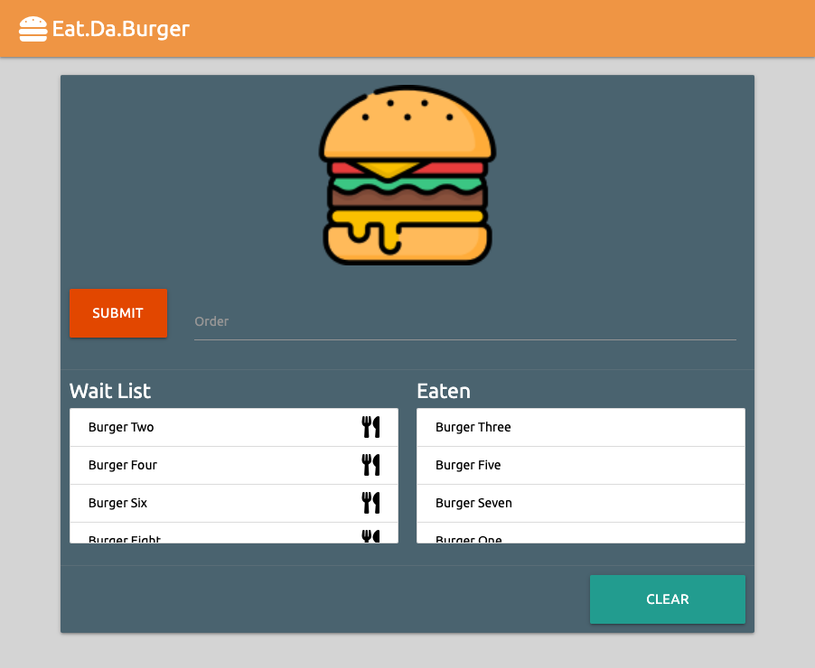
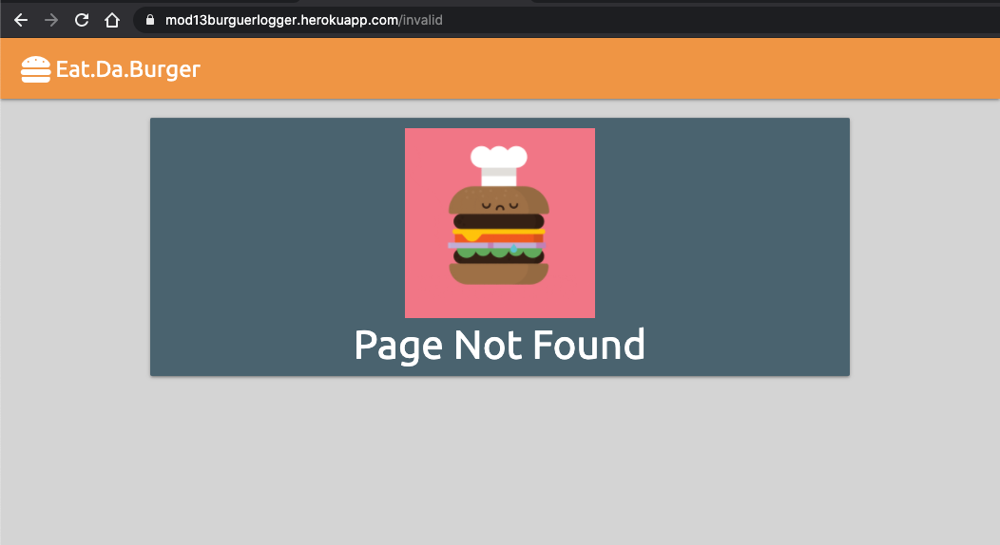
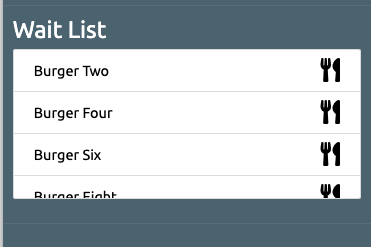
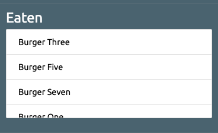
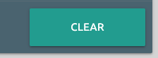

# 13 MVC: Burger Logger

   

## Description

Build a Burger Logger application that follows an MVC design pattern along with Node, Express and MySQL to query and route data with Express-Handlebars in order to generate UI HTML.

## Snapshot



## TableOfContents

* [Description](#Description)
* [Snapshot](#Snapshot)
* [TableOfContents](#TableOfContents)
* [UserStory](#UserStory)
* [AcceptanceChecklist](#AcceptanceChecklist)
  * [InitialRequirements](#InitialRequirements)
  * [ApplicationRequirements](#ApplicationRequirements)
* [AppConfig](#AppConfig)
  * [DatabaseConfig](#DatabaseConfig)
  * [ExpressConfig](#ExpressConfig)
  * [HandlebarsConfig](#HandlebarsConfig)
  * [DirectoryStructure](#DirectoryStructure)
* [AppUsage](#AppUsage)
  * [Installation](#Installation)
  * [Configuration](#Configuration)
  * [Operation](#Operation)
  * [Output](#Output)
* [URLS](#URLS)

## UserStory

1. Eat-Da-Burger! is a restaurant app that lets users input the names of burgers they'd like to eat.

2. Whenever a user submits a burger's name, the app will display the burger on the left side of the page -- waiting to be eaten.

3. Each burger in the waiting area also has a `Devour it!` button. When the user clicks it, the burger will move to the right side of the page.

4. Your app will store every burger in a database, whether devoured or not.

5. [App functionality is based on the one shown in this video](https://youtu.be/msvdn95x9OM).

## AcceptanceChecklist

### InitialRequirements

1. Attempt to complete homework assignment as described in instructions.

- Done. Issac.

2. If unable to complete certain portions, please pseudocode these portions to describe what remains to be completed.

- All functionality specified was implemented. Done. Issac.

3. Hosting on Heroku and adding a README.md are required for this homework.

- Done. Issac.

4. In addition, add this homework to your portfolio, more information can be found below.

- Done. Issac.

### ApplicationRequirements

1. Create a GitHub repo called `burger` and clone it to your computer.

- we created a repo called `mod13burgerlogger`. Done. Issac.

2. Make a package.json file by running `npm init` from the command line.

- Done. Issac.

3. Install the Express npm package: `npm install express`.

- Done. Issac.

4. Create a server.js file.

- We called it `app.js`. Done. Issac.

5. Install the Handlebars npm package: `npm install express-handlebars`.

- Done. Issac.

6. Install MySQL npm package: `npm install mysql`.

- we are using `mysql2` because of `sequelize`. Issac.

## AppConfig

### DatabaseConfig

1. Local instance of `MySQL` was not deployed,  `Heroku` DB instance using `JAWS DB` was configured and hooked up since the beginning in order to start developing.

2. Connection details are established in `config\connection.js` and with `.env` files locally.

3. DB Sequelize model is specified in `models\Burger,js` file and `index.js` is used in order to push all the available models into our target DB. 

4. `seed.mysql` file can be used to push some sample data by logging into MySQL workbench and running that script.

5. The following DB Model was implemented in `Burger.js`

* **ID** - INT, Primary Key, Autogenerated.
* **BurgerDesc** -  VARCHAR(254) to hold role title. Value can't be NULL.
* **Eaten** -  BOOLEAN, True if burger already has been eaten, false if otherwise. Default value is false.
* **Create** -  Autogenerated timestamp for when row was posted.
* **Update** - Autogenerated and self updating timestamp for when row is updated.

### ExpressConfig

1. Express functionality was developed in `app.js`.

2. Middleware logger is detailed.

3. Models are invoked.

4. Static resource folders are specified.

5. Handlebars template folders are detailed.

6. API router files are defined.

### HandlebarsConfig

1. Handlebars templates are located in `views` folder.

2. `Layouts` folder contains the main page layout which includes navbar, footer and main container definition.

3. `burger.handlebars` contains the main functionality.

4. `notfound.handlebars` specifies the page to be rendered if the user tries to access a page that doesn't exist.

5. `helper\handlebars` folder contains `exphbs-helper.js` file which overloads handlebars operation so we can detect when no records are displayed and render a `No records available` message.

6. Handlebars pages are rendered when `routes\public` static api routes are invoked.

### DirectoryStructure

The following directory structure was implemented:

```
config/connection.js ....................... Connection function for Heroku DB..
helper/ .................................... Helper functions.
  axios/internal.js ....................... API call that retrieves DB records and arranges it in an object for handlebars to display on burger page.
  handlebars/exphbs-helper.js ............. Overloading methods for Handlebars functions.
  joi/burger.js ........................... API validation.
middleware/logger.js ....................... CLI logger for Express server.
models/ .................................... CRUD operations for Tables and views in DB.
  Burger.js ............................... DB Sequelize definitions.
  index.js ................................ Sequelize-Express interface that handles pushing the specified models into target DB schema.
public/assets/ ............................. Static assets folder
  /css/style.css .......................... CSS Styling folder.
  /img .................................... Image resources used.
  /js/burger.js ........................... Front end JQuery code.
routes/..................................... API Route folder.
  api/burger.js ........................... API CRUD operation routes.
  public/pages.js ......................... Static pages routes.
views/ ..................................... Handlebars template folder.
  layouts/main.handlebar .................. main handlebars template, specifies navbar, footer and main body containers.
  burger.handlebars ....................... main app functionality is rendered by this template.
  notfound.handlebars ..................... displays this page when the user does not access an invalid page.
.env ....................................... Environment variables.
.eslintrc.json ............................. Eslint config.
.gitignore ................................. files not pushed to git.
.travis.yml ................................ Travis linkage.
app.js ..................................... Express server functionality and entrypoint.
package.json ............................... Specifies the packages during this project.
package-lock.json .......................... Package-json related references.
README.ms .................................. Readme specifying app details.
seed.sql ................................... Seed file with regards to be used as initial DB data load.
```
## AppUsage

### Installation

1. No installation is necessary.

### Configuration

1. No configuration is required.

### Operation

1. When you access the URL you should see the main page being displayed.


2. In case you navigate to a invalid page, the following will be displayed.



3. If you want to submit an order type the burger you want to eat click the `Submit` button.


4. The burger will be listed in the `Wait List`(scrollable). If you want to eat the burger click on the `fork and knife` logo.



5. After clicking the `fork-knife` logo the selected burger will be listed in the `Eaten` list (scrollable).



6. Click on the `Clear` button in order to clear all data from the lists.



## URLS

The following links provide video walkthrough of the app usage.

1. [Live App Heroku Link](https://mod13burguerlogger.herokuapp.com/)

2. [Github Repo Link](https://github.com/carlosissac/mod13burguerlogger)

3. [Portfolio Link](https://carlosissac.github.io/mod08hwprofessionalmaterials/)
